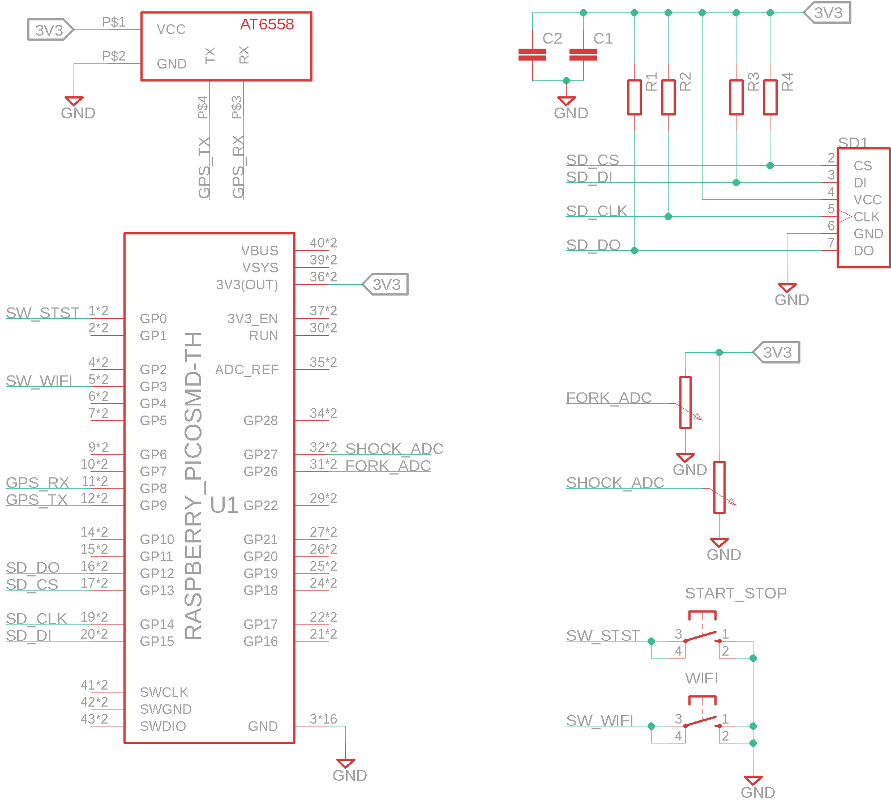

# bahama-mama-telemetry

Bahama Mama Telemetry aims to be a simple suspension telemetry system. Most of the parts shall be "off the shelf".

In general it shall have a similar feature set as the BYB system, the only problem will be the sampling frequency. As 1000Hz seems to be a bit too much for a small microcontroller as used in this system.

First of all the goals or requirements of the system:
1. The system shall read two position sensors via the ADC of the used microcontroller.
2. The system shall read the current GPS position.
3. The system should measure acceleration.
4. The system should measure gyroscopic movement.
5. The system should measure braek usage.
6. The system should measure the wheel speed.
7. The system shall save all values to a (micro) sd card.
8. The system should be able to present the measured values via WiFi.

As you might notice some requirements are currently inserted with a should. This means they will be addressed later on. The first iteration of the system shall only be used to give basic measurements to a user.

In addition to the system reading the values a software/service to interpret the data is in development. The goals for this system will be listed below.

Goals/Requirements analysis software.

# Hardware

As a base for the first development a Raspberry Pi Pico W will be used. As the processor board is fairly cheap and can easily be obtained it is a good base for this project. In addition it has a dual core processor which means acquistion of data and storing of data can be easily split to both cores with a small queue in between.

The schematic of the first iteration is shown below.

